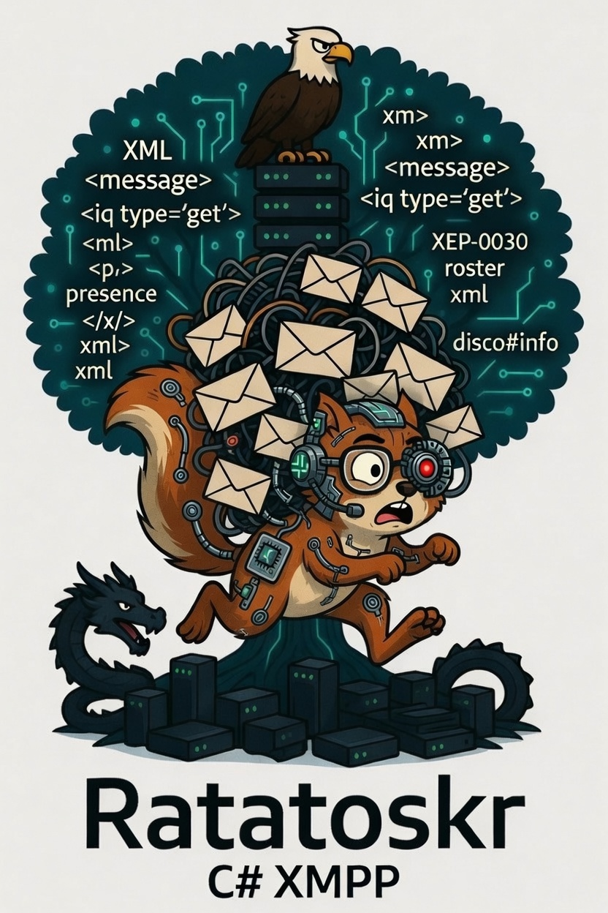



# Ratatoskr — XMPP for .NET 10

[](https://github.com/Vanaheimr/Ratatoskr/actions/workflows/ci.yml)
[](https://github.com/Vanaheimr/Ratatoskr/actions/workflows/nightly.yml)

Two badges over the same suite on the same two platforms, Windows and Debian
13 — this repository pins nothing, so there is no second set of revisions for
a nightly to reach for. What it adds is the calendar. **CI** only fires on a
push here, and a push to Hermod or Styx is not one: build against their master,
as both workflows do, and a break made over there waits for the next commit in
this repository and then arrives looking like that commit's fault. **Nightly**
asks the same question every night and writes the three revisions it asked it
of into the run summary. It also simply runs a thousand asynchronous checks
again, which is how a test that fails one time in twenty is found.

An XMPP library: client, server, and the extensions in between. WebSocket
transport per RFC 7395, TCP for server-to-server, SCRAM authentication,
federation across the domain boundary, publish-subscribe, and end-to-end
encryption per OMEMO.

> **Maturity:** Experimental. Client and server connect, authenticate and
> exchange messages — against each other and against Prosody 13 and ejabberd
> 24.12. Verified, not claimed: until recently the same sentence stood here
> about ejabberd, and in fact the client could not have logged in to *any*
> RFC 7395-conformant server, because its stanzas went out without a namespace.
> Connection management and error handling are incomplete (see
> [Known limitations](#known-limitations)). Not for production use.

Ratatoskr is the squirrel that runs up and down the world tree in the Edda,
carrying messages between the eagle in the crown and the dragon at the root.
A messenger, not a party to the conversation.

A console client built on this library lives in
**[XMPPConsole](https://github.com/Vanaheimr/XMPPConsole)**; the checks against
foreign servers, together with the setups that produce them, live in
**XMPPConformanceTests**.

## Authentication

| Method | Status |
|--------|--------|
| SCRAM-SHA-256 | ✅ Preferred |
| SCRAM-SHA-1 | ✅ Fallback |
| SASL PLAIN | ⚠️ Last resort |
| SCRAM-SHA-256-PLUS / SCRAM-SHA-1-PLUS | ✅ Preferred over anything unbound, `tls-server-end-point` only |

The strongest offered mechanism is chosen — by rank, not by the order in which
the server announces them. Two floors guard against downgrade, both on
`XMPPConnection`:

| Property | Effect |
|---|---|
| `PinnedSaslMechanism` | Whatever the last login succeeded with. Works on its own, but only from the second connection onwards. |
| `MinimumSaslMechanism` | What the caller demands. Works from the first frame, but has to be set. |

Both are checked *before* the `<auth/>` goes out — with PLAIN the password
would be in that very frame. If the server offers less than one of the floors
demands, no connection is established and no reconnect is attempted.

The pinning is a trust-on-first-use: if the man in the middle is already there
during the very first handshake, it pins his downgrade instead of fending it
off. Anyone who knows what their server can do should therefore also set
`MinimumSaslMechanism`. What it does fend off unaided is the attack that pays:
the client comes back on its own after every drop, and a drop can be provoked.

Both of those are guesses about what a server ought to be able to do. Where the
far side cooperates there is a measurement instead — **XEP-0474**: the server
hashes the mechanism list it announced into its server-first-message, and since
RFC 5802 puts that message into the `AuthMessage` verbatim, the hash is already
covered by the client proof and the server signature. An attacker who strikes
`SCRAM-SHA-256` from the features can recompute the hash — it is unkeyed — but
then the proof no longer matches, and he does not know the password. He may have
the hash or the proof, not both.

Both sides are implemented, and `XMPPConnection.DowngradeProtection` says which
of three things happened: `Verified`, `Mismatch` (the login is refused), or
`NotOffered` — which is every server that has not implemented an experimental
XEP, and is why the two floors above stay. They need nothing from the far side.

## XEP support

Legend: ✅ working · ⚠️ implemented with known gaps · 🚧 present but off by default · ⛔ deliberately not implemented

| XEP | Name | Status | Note |
|-----|------|--------|------|
| XEP-0013 | Flexible Offline Message Retrieval | ⛔ | Listed as *Deprecated* by the XSF (version 1.3, 2021-05-04): "Implementation of the protocol described herein is not recommended." Offline storage stays with the automatic flush per RFC 6121 §8.5.2.2.1 and XEP-0160 — see the work plan of the XMPPConformanceTests project, D37 |
| XEP-0030 | Service Discovery | ✅ | disco#info and disco#items, both queried and answered. The request's `node` is mirrored back per §3.2; only nodes that denote this entity are answered — the caps node with and without the current `#ver` (XEP-0115 §6.2). Every other one, including a stale `ver`, gets `<item-not-found/>` with the query echoed back. disco#items answers from `DiscoManager.LocalItems` (empty by default: a client has no sub-entities); a `node` there is a branch in the tree and is rejected. The test server keeps no nodes and rejects every one |
| XEP-0060 | Publish-Subscribe | ⚠️ | Incoming events are parsed, checked against spoofing, and carry their `SubID` from the SHIM header. Outgoing, every request is correlated with its reply: a subscription counts only after the service has confirmed it, `pending` is not a confirmation, several subscriptions to the same node stand side by side, and without a `subid` neither unsubscribing nor configuring happens when there are several. Per-subscription configuration (§6.3) and node configuration (§8.2) are read and set — only what the service confirmed is recorded, and `<create/>` sends its settings along, so the node is never briefly open in between. Affiliations are read and assigned (§5.7/§8.9); a list with one unreadable entry counts as unreadable as a whole. The owner sees the subscribers of their node (§8.8.1) and can remove them (§8.8.2) — remove only: a client that signs others up unasked has no name here. An unsubscription by the service (§8.8.4) strikes the subscription from our own bookkeeping; a confirmation by notification is accepted only if there is **an open request of our own** to match it (§8.6) — otherwise a service could sign the client up unasked. A `pending` is recorded but does not count as a subscription: "what did I apply for" and "am I subscribed" are two questions. As an owner, the client shows incoming requests and answers them (§8.6.1/§8.6.2). Nodes are deleted and purged (§8.4/§8.5) — **a deleted node takes the subscription to it along, a purged one does not** — and the strike-out is per service and not per name: `urn:xmpp:omemo:2:bundles` is called that at every account. Individual items are retracted (§7.2); incoming, the retraction is reported with the ids of the affected items and leaves the subscription standing. See the work plan of the XMPPConformanceTests project, D70–D90 |
| XEP-0085 | Chat State Notifications | ✅ | Sending + receiving |
| XEP-0115 | Entity Capabilities | ✅ | ver string per §5.1 in full, including `xml:lang` and XEP-0128 forms, checked against both vectors from §5.2 and §5.3; replies are verified per §5.4, otherwise no cache entry |
| XEP-0128 | Service Discovery Extensions | ✅ | Foreign forms are read, our own are served from `DiscoManager.LocalForms`; both go into the ver string. Empty by default — see below |
| XEP-0156 | Discovering Alternative XMPP Connection Methods | ✅ | The HTTP path only, and only as far as it is safe: `host-meta` is loaded exclusively over HTTPS, and only `wss://` endpoints are adopted. BOSH (`xbosh`) is read and passed over — this client does not speak it. The DNS path via `_xmppconnect` is not missing; it has been removed from the XEP |
| XEP-0160 | Best Practices for Handling Offline Messages | ✅ | Server side: `normal` and `chat` are stored, `groupchat` is rejected, `headline` and `error` are dropped; so is a `chat` whose only content is a typing notification (XEP-0085), and without an error to the sender. Flushed on the next non-negative available presence, announced as `msgoffline`. Applies to messages from other servers too |
| XEP-0184 | Message Delivery Receipts | ✅ | With spoofing protection |
| XEP-0203 | Delayed Delivery | ✅ | The server stamps flushed messages, the client reads the stamp: `XMPPMessage.Timestamp` is when the message was **written**, `ReceivedAt` when it arrived, `IsDelayed` the difference. Read only on the outer stanza — a carbon brings the stamp of its inner message with it — and only with a zone: a time without a zone is not one (D59) |
| XEP-0198 | Stream Management | ✅ | Verified against Prosody 13 and ejabberd 24.12, on by default, with resumption; after a resend an ack is requested so the queue drains even without keepalive; the rejection is evaluated too — an `h` inside `<failed/>` confirms what the server did process |
| XEP-0199 | XMPP Ping | ✅ | Sending, answering, RTT measurement |
| XEP-0280 | Message Carbons | ✅ | With spoofing protection |
| XEP-0308 | Last Message Correction | ✅ | Receiving: `XMPPMessage.ReplacesId` names the superseded message, `IsCorrection` the fact. Sending: `CorrectLastMessageAsync` corrects the last message **to the same recipient** (section 5) and becomes the last one itself, so a correction can be corrected. In the console `/fix <text>`; announced in disco#info (D60) |
| XEP-0333 | Chat Markers | ✅ | Sending + receiving, namespace-checked against confusion with XEP-0184 |
| XEP-0384 | OMEMO Encryption | ✅ | Complete, `urn:xmpp:omemo:2` — see the "End-to-end encryption" section further down. Verified against the reference implementation python-omemo, in both directions (D69) |
| XEP-0420 | Stanza Content Encryption | ✅ | The envelope that OMEMO encrypts: `<content/>` with the sender inside it and padding of random length |
| XEP-0454 | OMEMO Media Sharing | ⚠️ | The receiving half, and nothing that touches the network: `AesGcmUrl` reads `aesgcm://host/path#[iv][key]`, hands out the `https` address the file lies at — without the fragment, which is the key — and decrypts the payload, tag checked. What is deliberately **not** here is the fetching: whether an incoming message may cause a request at all, how large a file may be, which addresses are refused. A library that downloads on its own gives that decision to whoever sent the message. The upload side (encrypting and offering a file) is missing entirely. IV of 12 bytes only — the older 16 byte form is refused with a reason rather than silently, since `AesGcm` takes no other nonce length |
| XEP-0440 | SASL Channel-Binding Type Capability | ✅ | Both sides. The server announces `tls-server-end-point` — and only when it has one, since an empty `<sasl-channel-binding/>` tells a client nothing it can act on; the client reads the list to decide whether to bind and to compute the XEP-0474 hash. `tls-exporter` is absent because .NET exposes no TLS exporter, not because the announcement cannot carry it |
| XEP-0474 | SASL SCRAM Downgrade Protection | ✅ | Both sides, version 0.5.0. The server hashes the list it announced into the `h` attribute of its server-first-message; the client hashes the list that reached it and compares. Checked against the one vector the XEP publishes, which pins the octet sort order, both separators and the choice of hash in a single comparison — an implementation that only agrees with itself passes every test written from its own behaviour. The channel-binding types announced under XEP-0440 form the second half of the hashed string, so both ends have to agree about them too — leave them out and every channel-bound login fails looking like a forged announcement. Absence of `h` is not a failure — almost nothing implements this yet, including the ejabberd this was first pointed at — but it is reported rather than silently passed as success |
| XEP-0352 | Client State Indication | ✅ | Both sides. The server announces `<csi/>` after login (§4.1) and does not answer `<active/>`/`<inactive/>` (§4.2). Only what will still be true later is held back: presence waits and **the latest per full JID supersedes the earlier ones** (§3); a message with a body, an `iq`, an error and every nonza go out at once; a chat state (XEP-0085) is dropped — delivered late it would not be delayed but wrong. What was held goes out **before** the stanza that flushes the buffer (RFC 6120 §10.1), and at the end of the connection into the buffer of unacked stanzas. Ceiling `MaxHeldWhileInactive` (default 100); on overflow the buffer goes out rather than anything being discarded. After a resumption "active" applies again (§5.2) — which is why the client re-declares itself after every handshake. In the console `/csi active|inactive` (D61) |

## RFC conformance

### RFC 6120 — XMPP Core

| Area | Status |
|------|--------|
| TLS (§5) | ⚠️ `wss://` over the WebSocket transport; `XMPPConnection.ServerCertificateValidator` allows a validation of your own, `null` leaves it to the operating system. No STARTTLS (§5.4) — WebSocket brings TLS along underneath, but a plaintext `ws://` is not refused |
| SASL negotiation and exchange (§6) | ✅ Client and server; the client takes the strongest offered mechanism and never a weaker one than last time, the server rejects one it did not offer |
| SASL abort (§6.4.4) | ✅ `<abort/>` is answered with `<failure><aborted/></failure>`, the half-started SCRAM exchange is discarded, and the stream is **not** ended — an abort is a foreseen step, not a violation. On the client connection and on the S2S stream; the initiator of an S2S stream does not answer it, it would be the sender |
| Directory harvesting (§13.11) | ⚠️ An unknown username gets the same SCRAM exchange as a known one — invented credentials derived from the name and a server key, with rejection only at the proof. Otherwise the answer would be in the flow rather than in the error word. The server key lives in the process, so across a restart the invented salts change; with PLAIN the timing still differs. The section's remaining countermeasures — rate limiting, error detail only to authenticated users — are missing |
| Resource binding (§7) | ✅ `XMPPConnection.Resource` (default `console-<pid>`, `null` leaves the choice to the server); a `<conflict/>` is followed by a second attempt without a request, every other rejection aborts |
| Legacy session (RFC 3921) | ✅ Skipped when the feature itself carries `<optional/>` |
| Stanza errors (§8.3) | ✅ Type, condition, text and `by` are parsed; pending requests fail instead of appearing to succeed |
| Answer to unhandled IQs (§8.2.3 rule 3) | ✅ Unknown `iq get`/`set` are answered with `<service-unavailable/>` |
| Impossible addresses (§8.3.3.8, §8.1.1.1) | ✅ If the value of `to` is not a JID per RFC 7622, the server answers `<jid-malformed/>` (error type `modify`) and does not deliver — for `message`, `presence` and `iq` at the same place, before every branch. **Both origins:** from a peer the `from` is checked too, and before the question of which domain it may speak for — applying `DomainOf` to something that is not a JID compares fragments. An impossible `from` ends the stream with `<invalid-from/>` per §8.1.1.1; an impossible `to` costs only the stanza (D51, D53). The sender of the rejection is the server itself and not the intended recipient: the address is not one, so nobody there looked at it. A stanza **without** a `to` is not affected (§8.1.1.1), and an error stanza is not followed by an error (§8.3.1) — it is dropped all the same. The check is the same RFC 7622 check the client uses on its own addresses |
| IQ type check (§8.2.3 rule 2) | ✅ If the `type` attribute is missing or carries anything other than `get`, `set`, `result` or `error`, `<bad-request/>` follows with error type `modify` (§8.3.3.1). Checked in both roles the section names: by the client as recipient and by the server as an "intermediate router" — there **before** any delivery, so also for what goes to the server address itself, to a local recipient, or across the boundary. Likewise for what comes in from a peer. Without an `id` the rejection still goes out and then carries none |
| Stream errors (§4.9) | ✅ Parsed; after a non-retryable condition no reconnect is attempted |
| Dispatch of incoming frames (§8.1) | ✅ Decided on the **element name**, not on a prefix: `<iqbogus/>` is not an `iq`, `<presence-probe/>` is not a `presence`, `<opencast/>` is not a stream open. A namespace prefix does not change the type (`<client:iq/>` is an `iq`; `<stream:features/>` and `<features/>` are the same element) |
| Unknown element at stream level (§4.9.3.24) | ✅ On both streams — client and S2S — `<unsupported-stanza-type/>` follows and the stream ends (§4.9.1.1). This also holds for an unknown element in a **known** namespace: `<enabled/>` is a proper XEP-0198 element, but it comes from the server and not from the client. For the S2S stream this was measured rather than assumed beforehand: across the full run against Prosody and ejabberd, outbound as well as inbound, not a single unknown frame arrived there. A frame **without** an element is not an unknown element and is passed over — whitespace is permitted as a keepalive (§4.6.1) |

### RFC 6121 — Instant Messaging and Presence

| Area | Status |
|------|--------|
| Fetching, adding, removing roster items, groups | ✅ The groups (§2.1.2.4) were lost halfway until D91: the client sent them, the server read the `<item/>` only as far as its attributes and pushed the same entry back without them — and because a push **replaces** an entry's groups, they vanished on the client too. Now the server carries them, emits them in fetch and push, they count towards the roster version, and they survive a restart |
| Result replaces the cache (§2.1.4) | ✅ A contact removed while the client was offline is gone afterwards — before, it stayed |
| Applying roster pushes | ✅ Additive, not replacing: a push carries only the changed entries |
| Sender validation of roster pushes (§2.1.6) | ✅ Only without a `from` or with our own bare JID; otherwise dropped and reported as spoofing |
| Roster versioning (§2.6) | ✅ Client and server; `<ver/>` is announced, an unchanged roster comes back as an empty result, pushes carry the new version. The version is a hash over the content — switchable via `XMPPServer.OfferRosterVersioning` |
| Requesting/accepting/declining a presence subscription | ✅ |
| Incoming `subscribed`/`unsubscribed`/`unsubscribe` | ✅ Change the subscription state and do not count as presence |
| Message types (§5.2.2) | ✅ `chat`, `groupchat`, `headline`, `normal`, `error`; a missing or unknown value counts as `normal`. `groupchat` and `headline` are never answered automatically — everyone present would see a receipt sent into a room |
| Delivery rules by type (§8.5) | ✅ To the bare JID: `groupchat` is refused with `<service-unavailable/>`, `error` silently dropped, `headline` goes to **all** resources with non-negative priority, `normal`/`chat` to one. To a matching resource: everything, including `groupchat` and `error` (§8.5.3.1). To a resource that does not exist: `chat` as if to the account (§8.5.3.2.1), everything else silently dropped. Applies to messages from local clients **and** from other servers — the section speaks of an "inbound stanza" and does not distinguish the origin. A rejection finds its way back across the boundary |
| Offline storage (§8.5.2.2.1) | ✅ With no reachable resource, `normal` and `chat` are stored and flushed on the next non-negative available presence — with an XEP-0203 stamp, across a restart, and announced as `msgoffline` in disco#info. For messages from other servers too, and that is the normal case. Switchable via `XMPPServer.StoreOfflineMessages`; then the sender gets `<service-unavailable/>`, which the same section permits as an equal alternative. Ceiling `MaxStoredOfflineMessages` (default 100): once reached, the new message is refused and no stored one is displaced |
| IQ delivery rules (§8.5.1, §8.5.2.1.3, §8.5.2.2.3, §8.5.3.2.3) | ✅ A request to a bare JID is not delivered but answered by the server with `<service-unavailable/>` — exactly once, and the same for an unknown account, so the answer gives no accounts away. To a matching resource it is delivered; without one the server answers. A `result` or `error` is never answered (RFC 6120 §8.2.3 rule 4) and not fanned out to a bare JID. Applies to both origins |
| Request to the server address (§8.2.3 rule 3) | ✅ Ping (XEP-0199) and disco#info (XEP-0030) the server answers for itself — to a local client as to a peer, because the answer does not depend on who asks; only the way back differs. What it does not know gets `<service-unavailable/>` rather than silence. **Not** reachable this way are binding, legacy session, carbons and the roster: those change the state of a session or belong to an account — a foreign server asking for the roster gets the same refusal as for any unknown request |
| Message to an unknown account (§8.5.1) | ✅ The section leaves the choice between `<service-unavailable/>` and silence, but it has to be the same as for an existing account that is simply not watching — otherwise it answers the question "does this account exist?". So the question asked is not whether an account exists, but whether the store would accept the message: for an unknown one it is empty, and an empty one accepts as long as anything fits at all. If the store is off or full, both get `<service-unavailable/>`; if it is on, the server stays silent for both. Nothing is stored for an unknown account (D52) |
| IQ check against presence leaks (§8.5.3.1) | ✅ A request to a resource is delivered only if the recipient shares their presence with the asker — via the roster (`from` or `both` in **their** half) or via directed presence (§4.6). Otherwise the same answer as for a resource that does not exist; nothing can be read out of the rejection. It does not apply to `result` and `error` — those the server must deliver per the same section |
| Directed presence (§4.6) | ✅ Recorded per resource, cleared on logout, withdrawn on a directed `unavailable`, and likewise when the recipient sends us an unavailable of their own (§4.6.1, MUST and SHOULD). When the resource becomes unavailable — by its own logout or by a dropped connection — the unavailable goes to every recipient of directed presence who does not already get it via the roster (§4.6.3 rule 2). A status change mid-session does not end the grant |
| Presence delivery rules (§8.5.2.1.2, §8.5.3.1) | ✅ Available and unavailable presence goes to all resources at a bare JID, to the matching one at a full JID, otherwise silently nowhere (§8.5.1, §8.5.3.2.2) — for both origins |
| Presence probe (§4.3) | ✅ Answered by the server itself and delivered to no client, whether it comes from a local client or from a peer. A probe to a foreign domain it sends onwards (§4.3.1). It answers only if the asker is in the subject's roster with `from` or `both`; otherwise silence, which does not give away an unknown account either (§8.5.1 leaves the choice) |
| Presence priority (§4.7.2.3) | ✅ Read and honoured; a negative priority receives nothing that went to the bare JID, but stays addressable directly. The client sets it via `XMPPConnection.PresencePriority` |

### RFC 7395 — XMPP over WebSocket

| Area | Status |
|------|--------|
| Subprotocol `xmpp`, `<open/>`/`<close/>` framing | ✅ |
| Close handshake | ✅ `<close/>` is sent, then up to 3 s of waiting for the other side, then the socket is torn down |
| Endpoint discovery (XEP-0156 / `host-meta`) | ✅ With no endpoint given, `https://<domain>/.well-known/host-meta.json` and then `.../host-meta` are read; only `wss://` addresses are taken. With no find it stays at `wss://<domain>:5443/ws` |

The default port is ejabberd-specific and only applies when the domain serves
no `host-meta`. Whoever does not want it gives the URL, e.g. for Prosody:
`wss://<host>:5281/xmpp-websocket` — a given endpoint is never overridden.

### RFC 5802 / RFC 7677 — SCRAM

| Area | Status |
|------|--------|
| Four-step handshake | ✅ |
| Nonce check against MITM | ✅ |
| Server signature verification (constant time) | ✅ Mandatory — a `<success/>` without a server-final-message aborts the handshake |
| SASLprep (RFC 4013) | ✅ Complete: mapping, NFKC, prohibited tables, unassigned code points and the bidi rules; checked against the example table from §3 |
| Channel binding — `tls-server-end-point` (RFC 5929 §4.1) | ✅ Both sides, announced per XEP-0440. MD5 and SHA-1 signatures promoted to SHA-256; a certificate whose signature carries no readable hash (Ed25519, Ed448, RSASSA-PSS) gets no binding rather than a guessed one |
| Channel binding — `tls-exporter` (RFC 9266) | ❌ Blocked on the platform: .NET 10 exposes no `ExportKeyingMaterial` on `SslStream` (checked against the reference assembly, 10.0.11) |

### RFC 7622 — JID handling

`JidUtilities` splits, validates and compares JIDs per RFC 7622; checked
against both example tables from §3.5 (fifteen valid and eight invalid
addresses).

| Rule | State |
|---|---|
| Splitting in the order given by §3.2 (first `/`, then `@`) | ✅ |
| Localpart: UsernameCaseMapped, plus the exclusions from §3.3.1 | ✅ Mapping rules complete, IdentifierClass from the derived properties per RFC 8264 §8 |
| Resourcepart: OpaqueString, **not** lowercased | ✅ Likewise, with the FreeformClass |
| Domainpart: lowercased, NFC | ✅ IDNA2008 label by label (RFC 5891/5892), Punycode computed here (RFC 3492), bidi rule per RFC 5893 over a table generated from `DerivedBidiClass.txt` |
| Maximum length 1023 octets per part | ✅ |
| Comparison: local and domain part case-insensitive, resourcepart not | ✅ |

Class membership comes from `Precis.DerivedProperty` and thus from the ladder
in RFC 8264 §8: exception list (RFC 5892 §2.6), Unassigned, ASCII7,
JoinControl, old Hangul Jamo, ignorable characters, controls, HasCompat,
LetterDigits, OtherLetterDigits, Spaces, Symbols, Punctuation — in that order,
because many code points sit in several of these categories.
`Default_Ignorable_Code_Point`, `Noncharacter_Code_Point` and
`Hangul_Syllable_Type` are not provided by .NET; they sit in the source as
range tables, named with the Unicode version they came from (15.1.0).

The domainpart goes through `Idna` — the same building blocks, but the ladder
from RFC 5892 §1 instead of the one from RFC 8264 §8, and therefore different
answers: an underscore belongs in a localpart and in no label, a symbol in a
resourcepart and in no label. An A-label (`xn--…`) is decoded, checked against
the label rules and re-encoded; if the re-encoding yields a different spelling,
it is rejected. Address literals (`127.0.0.1`, `[::1]`) are exempt per
RFC 7622 §3.2.

If a single label carries right-to-left characters, the whole name is a
*bidi domain name* (RFC 5893 §2), and then **all** labels must satisfy the six
conditions — including the pure-ASCII ones. `9abc.example` is therefore a valid
domain name and `9abc.אבג` is not. The bidi classes live in
`Ratatoskr/Common/BidiClasses.cs`, generated by
`tools/unicode/generate-bidiclass.py` from `DerivedBidiClass.txt`.

The contextual rules from RFC 5892 appendix A are fully implemented — for
localparts as well as for domain labels. They do not depend on the code point
but on its surroundings: `col·la` is a Catalan word and a valid localpart,
`co·lla` is not. The properties needed for that
(`Canonical_Combining_Class`, `Joining_Type`, `Script`) live in
`Ratatoskr/Common/ContextTables.cs`, generated by
`tools/unicode/generate-contexttables.py`.

**One deliberate deviation:** example 18 of table 2
(`juliet@example.com/ foo`, leading space in the resourcepart) is accepted.
The table lists it as a non-JID, but the rule for that is missing — the
OpaqueString profile explicitly permits spaces. For a router, accepting is also
the more cautious choice: rejecting an address that other servers consider
valid loses messages.

## Keepalive

Default interval **25 seconds**, adjustable on `XMPPConnection`. Changes take
effect only after a reconnect, because the loop is started during the
handshake.

**Methods:** if stream management is active an `<r/>` is sent (lightweight),
otherwise an XEP-0199 ping.

## Connecting: succeeded or thrown

`ConnectAsync` **throws** when the handshake fails — the original error, not a
wrapper around it: `AuthenticationException` on a rejected login,
`XMPPProtocolException` on a failed negotiation. Whoever survives the call has
a connection.

**The transport itself is the one exception.** If the connection never comes
about at all, the error from down there reads "Unable to connect to the remote
server" and does not name the address — which, since XEP-0156, may also come
from a foreign domain's `host-meta` and then appears in no source file. That
one case is therefore wrapped in an `XMPPProtocolException` that names the
endpoint; the original error is kept as the `InnerException`. A cancelled
handshake stays an `OperationCanceledException`.

Only the explicit call throws. The background reconnect attempt has no caller
and keeps reporting via `OnError` and `OnStateChanged`.

## Timeouts during the handshake

Every read step of the negotiation — stream header, features, each SASL round —
has **10 seconds**, and so does resource binding. When a deadline expires the
handshake fails with a message naming the step ("no answer to the stream header
within 10 seconds").

The reason is the one case an error does not cover: a peer that accepts the
connection and then **says nothing**. An error arrives, a closed socket
arrives — silence does not arrive, and without a deadline `ConnectAsync` would
never return.

## Spoofing protection

The client checks the sender of three kinds of message before processing them:

1. **Carbons (XEP-0280)** — must come from our own bare JID (that is, from our
   own server). Otherwise any contact could inject arbitrary messages as
   supposedly sent by us.
2. **Receipts (XEP-0184)** — must come from the bare JID of the original
   recipient.
3. **PubSub events (XEP-0060)** — must come from the configured PubSub service
   **or from the one this node was subscribed at**. The second permission
   hangs on the node and not on the sender: subscribing to one node at Bob's
   did not permit Bob to send notifications about every other node he can think
   of. Without it no PEP notification got through at all — per XEP-0163 those
   come from the account itself and therefore counted as forgeries every time.
4. **Roster pushes (RFC 6121 §2.1.6)** — must come without a `from` or from our
   own bare JID. Otherwise any sender could inject contacts into the local
   roster or delete them from it.

5. **Caps replies (XEP-0115 §5.4)** — a disco#info reply enters the cache under
   `node#ver` only if its SHA-1 hash yields exactly that `ver` value.
   Otherwise anyone whose presence arrives here could announce the `node#ver`
   pair of a widespread client, answer with a list of their choosing, and thus
   plant it on every further contact announcing the same pair.

## Architecture

Three layers, cleanly separated:

| Layer | Type | Job |
|-------|------|-----|
| UI | — | Command line, command dispatch, presentation. Does not belong in this library; the XMPPConsole project holds a console for it. |
| Application | `XMPPClient` | Session state (chat partner, pending contact requests, last message id) and composite operations. |
| Protocol | `XMPPConnection` | WebSocket I/O, SASL, resource binding, stanza routing. |

`XMPPClient` and `XMPPConnection` write nothing to the console — everything
runs through events and the injected `ILoggerFactory`.

### The handshake

The handshake falls into two parts, and the boundary is resource binding:

1. **Negotiation** (`<open/>`, stream features, SASL, binding). Here
   `ConnectInternalAsync` reads from the socket itself. That is unproblematic
   because the server has no resource yet to deliver anything to — nothing else
   can arrive. Evaluation goes through `StreamNegotiation`, a collection of
   pure functions over the parsed `XElement`.
2. **Session setup** (legacy session, XEP-0198, carbons, roster, presence).
   From binding onwards the receive loop is running, and every step goes
   through `SendIqAsync` — the same `TaskCompletionSource` correlation over the
   stanza id that `DiscoManager` and `PingManager` use. Whatever else arrives
   during that time (flushed messages, presence, roster pushes) is delivered
   normally.

Only `StreamManagementManager` (reads `h` and `id` from nonzas),
`StanzaError`/`StreamError` (which have to cope with malformed frames in
particular) and `SCRAMAuthenticator` (SASL is not XML) work on text patterns,
and they do so deliberately.

### Using it as a library

```csharp
using Microsoft.Extensions.Logging;
using org.GraphDefined.Vanaheimr.Ratatoskr;

using var loggerFactory = LoggerFactory.Create(b => b.AddSimpleConsole());

await using var client = new XMPPClient(
                             "user@example.com",
                             "secret",
                             "wss://xmpp.example.com:5443/ws",
                             loggerFactory);

client.OnMessage += msg =>
    Console.WriteLine($"{msg.FromBareJid}: {msg.Body}");

client.OnSubscriptionRequest += async (from, status) =>
    await client.AcceptSubscriptionAsync(from);

await client.ConnectAsync();

client.SetChatPartner("contact@example.com");
await client.SendMessageAsync("Hello!");
```

The `ILoggerFactory` is optional; without it everything falls back to
`NullLogger` and nothing is logged. Log levels: `Information` for connection
steps, `Debug` for protocol detail, `Trace` for individual stanzas, `Warning`
for repelled spoofing attempts and protocol oddities.

## Project structure

The namespace is uniformly flat, `org.GraphDefined.Vanaheimr.Ratatoskr` (as
with `Hermod.DNS` and `Hermod.HTTP`); the folders only group. The server has
one of its own, `…Ratatoskr.Server` — there are types down there whose names
exist a second time on the client side. One file per type:

```
Ratatoskr/
├── Client/            XMPPClient, XMPPMessage, MessageType
├── Common/            JIDs (RFC 7622), PRECIS, IDNA, Punycode, bidi classes,
│                      stanza names and namespaces, XML escaping
├── Auth/              SCRAM (RFC 5802/7677), SASLprep, mechanism policy
├── Connection/        XMPPConnection: WebSocket I/O, negotiation, routing
├── Errors/            Stanza and stream errors
├── Rosters/           Roster, subscription states, stanza building
├── Server/            XMPPServer, XMPPSession, S2S, accounts, PEP
└── XEPs/              One folder per XEP, named after its number
    ├── XEP0004DataForms/                DataForm
    ├── XEP0030ServiceDiscovery/         DiscoManager, DiscoInfo, DiscoItems
    ├── XEP0060PubSub/                   PubSubManager, PubSubBuilder,
    │                                    affiliations, access models,
    │                                    subscriptions
    ├── XEP0085ChatStates/               ChatState
    ├── XEP0115EntityCapabilities/       EntityCapsManager
    ├── XEP0128DiscoExtensions/          DiscoForm, DiscoField
    ├── XEP0156AltConnections/           AltConnectionsResolver
    ├── XEP0184MessageReceipts/          ReceiptTracker, ReceiptBuilder
    ├── XEP0198StreamManagement/         StreamManagementManager
    ├── XEP0199Ping/                     PingManager
    ├── XEP0203DelayedDelivery/          DelayedDelivery
    ├── XEP0280MessageCarbons/           CarbonManager
    ├── XEP0308MessageCorrection/        MessageCorrection
    ├── XEP0333ChatMarkers/              ChatMarkers
    ├── XEP0352ClientState/              ClientStateIndication
    ├── XEP0384OMEMO/                    X3DH, DoubleRatchet, wire format,
    │                                    session store
    └── XEP0420StanzaContentEncryption/  SceEnvelope
```

The XEP managers get their send function injected as a `Func<string, Task>` and
know nothing about the transport — which makes them testable independently of
`XMPPConnection`.

## Tests

```bash
dotnet test RatatoskrTests/RatatoskrTests.csproj
```

NUnit 4.6.1, NUnit3TestAdapter 6.2.0, Test.Sdk 18.8.1 — the same versions as in
`HermodTests`. The fixtures are grouped by topic; the namespace stays flat,
`org.GraphDefined.Vanaheimr.Ratatoskr.Tests`, and the folders only group:

```
RatatoskrTests/
├── Infrastructure/     Base class of all fixtures, guard against internal errors
├── Common/             JIDs, stanza names, namespaces, IQ types, XML splitter
├── Auth/               SASL/SCRAM, mechanism policy, accounts and certificates
├── Streams/            Negotiation, binding, TLS, deadlines, reconnect
├── StreamManagement/   XEP-0198: counting, acking, resuming
├── Federation/         S2S: dialback, SRV, TCP/WebSocket, between two of ours
├── Routing/            Delivery rules, several resources, offline storage
├── Rosters/            Roster, subscriptions, versioning, push security
├── Stanzas/            Building, parsing and errors of individual stanzas
└── XEPs/               XEP-0115 caps and the payloads of the remaining XEPs
```

**This suite tests the library against itself.** Everything that needs a
foreign implementation — Prosody, ejabberd and python-omemo as a reference —
lives in the XMPPConformanceTests project, where the setups that produce those
far sides have always lived. A checkout of this repository alone therefore runs
all of it — 1184 tests, of which the platform decides how many get an answer:

| Platform | passed | skipped |
|----------|-------:|--------:|
| Windows | 1181 | 3 |
| Debian 13 | 1183 | 1 |

The skip both share checks a property which exists only in STARTTLS operation,
and the fixture is parameterised over the TLS modes, so in the other one the
question does not arise. The two extra on Windows are the file modes: the
account store and the OMEMO store are written `0600`, and `UnixFileMode` is a
question that platform has no answer to, so those two say so instead of
pretending.

**How many were skipped tells you afterwards what was measured** — so the
number to hold the run to is the one for the platform it ran on. CI runs both.

The counts move with the suite and are worth keeping current rather than round:
the passing figure stood at 1110 until XEP-0454 arrived, at 1119 until the
security review was worked through, at 1163 until XEP-0474 came in and at 1171
until channel binding did, and a figure nobody updates stops being a check and
becomes decoration.

Three tables in the source are **generated, not transcribed**:
`tools/unicode/` and `tools/stringprep/` fetch the Unicode file resp. the RFC
and write `Common/BidiClasses.cs`, `Common/ContextTables.cs` and
`Auth/StringPrepTables.cs` from them.

## XMPPServer

`Ratatoskr/Server/` holds a real XMPP server: over WebSocket (RFC 7395) to
clients, over TCP (RFC 6120) to other servers. It goes far enough for several
real `XMPPClient` instances to log in at the same time and talk to each other:

- TLS: `wss://` with a self-signed certificate the constructor creates
  (RFC 6120 §5). `new XMPPServer(useTLS: false)` falls back to `ws://`, which
  is meant for debugging with a capture
- SASL: SCRAM-SHA-256, SCRAM-SHA-1 and PLAIN, offered in that order. Which
  mechanisms those should be is governed by `OfferedSaslMechanisms`; one that
  was not offered is rejected even if a client attempts it
- Credentials per RFC 5802 §3 — salt, iteration count, `StoredKey` and
  `ServerKey` per mechanism. No plaintext password, not even for PLAIN: that
  one verifies by deriving anew from the password offered
- An **unknown username** gets the same exchange as a known one: invented
  credentials derived from the name and a server key — different per name,
  always the same for the same name — and the rejection comes only at the
  proof. Otherwise the answer to "does this account exist?" would be in the
  flow, whatever error word accompanies it (RFC 6120 §13.11, "Directory
  Harvesting")
- Accounts and rosters through `IXMPPAccountStore`: `InMemoryAccountStore`
  (default) or `FileAccountStore` for state that survives a restart
- Routing by domain: what does not belong here goes out through `IServerLinks`;
  an unreachable domain is answered with `<remote-server-not-found/>`.
  `DirectServerLinks.Connect(a, b)` joins two instances in the same process
  without any network at all — for tests, not for operation.
  `WebSocketServerLinks.Connect(a, b)` does the same over a real WebSocket S2S
  stream (`S2SStream`, its own handshake per RFC 7395 §3.4, subprotocol
  `xmpp-server`): a forged sender there ends not only the delivery but the
  stream and the connection (RFC 6120 §8.1.1.1, §4.9)
- Two S2S transports under the same protocol layer (`S2SStream`):
  `WebSocketServerLinks` (RFC 7395 framing, subprotocol `xmpp-server`, only
  between instances of this server) and `TcpServerLinks` (`jabber:server`
  streams over TCP per RFC 6120 — the route to ejabberd and Prosody). All that
  differs is the framing (`IS2SFraming`) and that TCP first has to cut the
  stream into elements with `XmlStreamSplitter`
- XEP-0288 Bidirectional Server-to-Server Streams: both directions over one
  connection. Without the extension each side answers over a connection of its
  *own* (RFC 6120 §4.1) — behind NAT, behind a firewall, or without a DNS entry
  the answer is then lost, and silently at that. Two switches, because they are
  two things: `OfferBidirectionalStreams` announces them on inbound
  connections, `RequestBidirectionalStreams` asks for them on outbound ones.
  Nothing goes over the reverse direction before the peer has identified
  itself, and nothing for a foreign domain. On both S2S transports, verified
  against Prosody 13 and ejabberd 24.12 in both directions.

  **Both** namespaces are announced (`urn:xmpp:features:bidi` and
  `urn:xmpp:bidi`), and both are read. The XEP knows only the first for the
  announcement; ejabberd 24.12 puts the enabling element into the features and
  picks up only the second. Observed, not assumed — with the XEP form alone it
  does not take our reverse direction. It stays unambiguous nonetheless: under
  either reading the enabling element is called `urn:xmpp:bidi`
- Stored subscription requests (RFC 6121 §3.1.3): whoever is not connected gets
  their requests at the next login — and again at every further resource, until
  they accept or decline. What is stored is the complete stanza including
  `<status/>`, exactly one per sender, with a ceiling per account. No roster
  entry is created in the process: the section's security warning forbids one
  before consent
- Subscription pre-approval (RFC 6121 §3.4): a contact can be approved before
  they ask; their later request the server answers itself and never delivers to
  the user at all. Announced as `urn:xmpp:features:pre-approval`, client-side
  `PreApproveContactAsync`
- Subscription handshake across the domain boundary (RFC 6121 §3): each side
  keeps its own half of the roster, and an applicant who is allowed to see the
  contact anyway is answered directly by the contact's server (§3.1.4)
- SRV resolution (RFC 6120 §3.2.1): peers are found via
  `_xmpp-server._tcp.<domain>` instead of being entered by hand, with the
  ordering from RFC 2782. A hand-entered address takes precedence; the
  certificate is checked against the domain sought, never against the host name
  from the SRV record
- SASL EXTERNAL on the TCP route (XEP-0178): the peer's domain is proven by its
  TLS certificate instead of by a dialback callback. `CertificateIdentity`
  reads the dNSName entries — when a SAN is present the common name no longer
  counts (RFC 6125 §6.4.4), and wildcards do not apply
- STARTTLS on the TCP route (RFC 6120 §5.4), the default of `TcpTlsMode`. It is
  announced as `<required/>` and it is: whoever declines encryption or does not
  offer it at all gets no stream — and no unencrypted one
- Dialback (XEP-0220) on both S2S routes: the peer's domain is proven, not
  believed. To do so the accepting server asks **not** the party wanting to
  identify itself but the address on file for that domain — over a separate,
  short-lived connection. Before dialback has passed, the stream carries no
  stanza
- Resource binding with a unique resource per connection
- Routing of `message`, `presence` and `iq` between the sessions
- Presence only to those entitled to it (RFC 6121 §4): contacts with `from` or
  `both`, plus our own other resources. Along with presence probes, the replay
  of contact state at login, and the unavailable at the end of a connection —
  even when it drops and the client itself can no longer say anything (§4.5.2)
- Subscription handshake (RFC 6121 §3): `subscribe`/`subscribed`/`unsubscribe`/
  `unsubscribed` change the rosters of **both** sides and trigger roster
  pushes; `ask='subscribe'` records a pending request
- XEP-0280 carbons (`sent` and `received`) between the resources of one account
- Server-side roster with roster push
- XEP-0163 Personal Eventing as a subset: an account can publish into PEP
  nodes, anyone can fetch them, and contacts with `from` or `both` are
  notified. **The server answers on behalf of the account and not the client**
  — otherwise an OMEMO bundle would only be retrievable while its owner is
  online. What is missing: node configuration, access models, filtered
  notifications via XEP-0115
- XEP-0060 §6.1/§6.2 subscriptions to PEP nodes: `<subscribe/>` and
  `<unsubscribe/>` with `subid`, along with the XEP's rejections —
  `<item-not-found/>`, `<invalid-jid/>`, `<not-subscribed/>`,
  `<invalid-subid/>`, `<subid-required/>`. **A subscriber gets the
  notifications even without presence authorisation.** Only whoever owns the
  `jid` may set it — otherwise anyone could sign anyone up or, worse, off
- Several subscriptions by the same JID to the same node: every `subscribe`
  creates one, delivery happens **per subscription** with the SHIM header
  `SubID` (§12.20), and unsubscribing without a `subid` is refused when there
  are several. An explicit subscription supersedes presence-based delivery, so
  the number of deliveries does not depend on who happens to be in the roster
- XEP-0060 §8.1/§8.2 creating and configuring nodes: `<create/>` with an
  optional form, `<configure/>` in the `#owner` namespace, and **the owner
  only**. A created node exists before anything is in it. Effective fields:
  `pubsub#max_items` (a smaller limit applies immediately),
  `pubsub#persist_items` (a node without storage only notifies),
  `pubsub#access_model` and `pubsub#roster_groups_allowed`. **All five** models
  are offered — `open`, `presence`, `whitelist`, `roster` and `authorize`;
  anything that is not a model name is rejected rather than shortened to `open`
- The access model is enforced: `presence` locks out anyone not allowed to see
  the owner's presence, both when fetching and when subscribing
  (`<not-authorized/>` with `<presence-subscription-required/>`); the owner
  always reaches their own node. **It does reveal that the node exists** —
  that is what XEP-0060 §6.5.3 prescribes, and for a node whose mere existence
  would be a secret, `presence` is the wrong instrument
- XEP-0060 §7.1.5 `<publish-options/>`: the preconditions of a publication are
  checked — either the node comes into being to match, or the publication is
  refused with `<conflict/>` and `<precondition-not-met/>`. That gives effect
  to the precondition OMEMO has always been sending along (XEP-0384 §5.2: a
  bundle must be openly retrievable)
- XEP-0060 §4.1/§8.9 affiliations per node: `publisher` may write into someone
  else's node (the notification still comes from the owner), `outcast` reaches
  no node at all and **loses existing subscriptions**, `member` reaches a node
  with the access model `whitelist`. The owner is the account and cannot be
  reassigned; `publish-only` is rejected rather than offered. Affiliations are
  managed by the owner (§8.9); one's own are listed by §5.7
- Third access model `whitelist`: in comes whoever the owner explicitly put on
  it — `member` or `publisher`. **The difference from `presence`:** a presence
  authorisation arises as a side effect, a list does not. Exclusion overrides
  both models
- XEP-0060 §5.6 `<subscriptions/>`: all of the asker's subscriptions across all
  nodes, with id and state, optionally narrowed to one node. **Only one's own**
  — anyone allowed to enumerate someone else's would learn who is interested in
  what. No subscriptions is an empty list and not an error
- XEP-0060 §8.8 the subscribers of a node — **the opposite direction from §5.6,
  and deliberately so:** there, other people's subscriptions are withheld
  because they would be information about people; here the question is not
  "where is this person subscribed" but "who is subscribed to my node", and the
  server answers that for the owner. Every entry names its id, so the same JID
  appears several times — without them none of its subscriptions could be told
  apart from the other. Removal uses `subscription='none'`: with a `subid`
  exactly one, without a `subid` all of that JID's, because the owner means the
  person and not the bookkeeping. What nobody can find is not removed but
  refused. **The owner cannot sign anyone up** — that is exactly what §6.1.3.1
  prevents from the other side, and owning the node changes nothing for the one
  whose inbox fills up. A `subscribed` for an existing subscription is valid
  nonetheless: a list that cannot be sent back unchanged would not be a state
- XEP-0060 §8.8.4 **whoever was ended without being asked finds out** — a
  notification with node, JID and id, and **one per extinguished subscription**:
  if a `none` without a `subid` produced only one, the recipient would know of
  one id that it was extinguished and nothing about the other. The same on
  exclusion (§8.9.4) — there without naming the affiliation: what they are at
  that node is none of their business, that they will no longer receive it is.
  What is reported is what happened, not what was instructed; a refused
  instruction unsubscribes nothing. A `headline`, and therefore **nothing for
  the store** (XEP-0160): whoever was offline does not find out — and finds it
  at the next connect via §5.6, where the state of now is, and not the state of
  back then
- XEP-0060 §4.5/§8.6 `authorize`: **the only model in which subscribing and
  getting in are two things.** Anyone may ask — the asking is the transaction —
  and the answer is a `pending`: the accepted question and not the approval.
  Until approval nothing arrives, neither via a subscription nor via presence,
  and nothing can be fetched either. The owner is presented with the request as
  a form (§8.6.1, `pubsub#allow` set to "no" — a form that already says yes
  turns clicking it away into an approval) and answers it either with that
  (§8.6.2) or via the subscriber list (§8.8.2). **Two doors, one room:** the
  list is an administrator's view, the form a person's. A "no" to a question
  from earlier does not end a subscription approved in the meantime
- XEP-0060 §7.2 `<retract/>`: a single item is retracted — by whoever would
  also be allowed to publish. **Whoever may write may also retract**; keeping a
  publisher away from other people's items would mean remembering who wrote
  which, and without that record every finer rule would be merely asserted. An
  item that does not exist is refused with `<item-not-found/>`, a node without
  storage with `<unsupported feature='persistent-items'/>` as when purging.
  **The notification takes the same route as a publication** — per
  subscription, with `subid`, and one that was silenced stays silent: a
  retraction is a delivery and not a message about the node. Retracting the
  last item leaves the node standing
- XEP-0060 §8.4/§8.5 deleting and purging nodes, both for the owner only.
  **What is deleted is the node, what is purged is only its content** — after a
  purge it keeps publishing to the same recipients, after a delete to nobody. A
  deleted node takes items, settings, subscriptions **and affiliations** with
  it: if the affiliations stayed, the next node of the same name would inherit
  an exclusion list nobody can see any more. A node without storage cannot be
  purged (§8.5.3.2, `<unsupported feature='persistent-items'/>`) — a `result`
  would be the statement that something had been purged. Both are notified
  (§8.4.2/§8.5.2), and **once per subscriber and without a `subid`**: it is not
  a subscription that ends but the node; naming an id would imply the others
  carried on. No second notification per §8.8.4 follows
- XEP-0060 §6.3 per-subscription configuration as a data form (XEP-0004) with
  **exactly one field**: `pubsub#deliver` silences this one subscription
  without ending it — and a silenced one does not fall back to presence-based
  delivery either. A field that was not in the offer is rejected rather than
  passed over; so is a `set` without a form. What the server cannot do it does
  not offer: a `pubsub#digest` that has no effect would be a promise without
  cover, and digests that never arrive look like quiet
- XEP-0352 Client State Indication: when a client declares itself inactive, the
  server holds back what can wait — presence (only the latest per full JID),
  receipts, markers. A chat state is dropped rather than held, because a
  "typing" from earlier is not late information when finally delivered but
  wrong information. Messages with a body, `iq`s, errors and nonzas go out
  immediately and unchanged
- XEP-0198 Stream Management with **its own, independently implemented**
  counting — the server deliberately does not use the same helper as the
  client, or the tests would check both sides with the same logic
- Stanza and stream errors on demand: `StanzaErrorIq(…)` and
  `session.SendStreamErrorAsync(condition)` — the latter also ends the stream,
  as RFC 6120 §4.9.1.1 requires: send the error, `<close/>` per RFC 7395 §3.6,
  tear the connection down
- Offline storage per RFC 6121 §8.5.2.2.1 and XEP-0160, with an XEP-0203 stamp;
  `StoreOfflineMessages` switches to the equally permitted alternative
  (`<service-unavailable/>` to the sender). A `chat` whose only content is a
  typing notification is dropped — the only message this server silently
  discards, and it does so because a typing notification promises nothing
- `OnInternalError` reports when handling a frame ends in an exception — with
  the frame. Afterwards the stream ends with `<internal-server-error/>`
  (RFC 6120 §4.9.3.8 and §4.9.1.1), followed by `<close/>` per RFC 7395 §3.6:
  what the frame was meant to change is half changed, and a stream about whose
  state the two sides hold different ideas is no longer a stream. The test
  suite hangs a guard on the event that treats every report as a programming
  error; `FailFrameHandling` reaches that path on purpose. It no longer depends
  on a fixture registering it: every server announces its creation via
  `OnInstanceCreated` (internal), and the guard finds it from there — including
  in a fixture that exists tomorrow (D54)
- Switches for error paths: `CompleteCloseHandshake`, `RouteStanzas`,
  `BroadcastPresence`, `DeliverCarbons`, `AnswerPings`,
  `OfferStreamManagement`, `AnswerAckRequests`, `SwallowClientStanzas`
  (discards incoming stanzas before they are counted — the only way to a stanza
  that leaves the wire and still does not arrive), `SweepResumableStreams`
  (stops the reaper — the only way to a stream whose deadline has expired while
  it is still sitting there), `FailPings`, `FailDiscoInfo`, `FailBind`,
  `SessionRequired`, `ConflictOnUsedResource`, `CorruptScramSignature`,
  `OmitScramSignature` — the last two for the counter-check on the second half
  of SCRAM: a server that does not know the password cannot produce the server
  signature, and the client must then refuse the login
- `DeliverAfterBind`: frames the server sends immediately after the bind reply
  — that is, right into the middle of the client's setup phase. A `{jid}` in
  them is replaced by the bound full JID.

```csharp
var alice = await ConnectClientAsync("alice");
var bob   = await ConnectClientAsync("bob");

bob.OnMessage += m => Console.WriteLine($"{m.FromBareJid}: {m.Body}");
await alice.SendMessageAsync(bob.BareJid, "Hello Bob!");
```

`Server.KillAllSessions()` simulates dropped connections,
`Server.SessionOf(fullJid)!.Kill()` a single resource.

Because the certificate is self-signed, no machine trusts it. The client
therefore needs a validation of its own; `Server.IsOwnCertificate` pins the
fingerprint of exactly this server:

```csharp
var connection = new XMPPConnection(jid, password, Server.Uri)
{
    ServerCertificateValidator = Server.IsOwnCertificate
};
```

A validator that just returns `true` would be shorter — but it would take the
authentication out of TLS and let the tests pass against a foreign peer too.

### What the server lacks for production

The name no longer says so — until recently the class was called
`FakeXMPPServer`. It is meant as a peer for tests and development, not as a
server implementation:

- **TLS without STARTTLS and without compulsion.** The server speaks `wss://`
  with a self-signed certificate generated at runtime (RFC 6120 §5). What is
  missing: STARTTLS (§5.4), a way to supply a certificate of your own, and the
  ability to forbid `ws://` — `new XMPPServer(useTLS: false)` still yields
  plaintext.
- **SCRAM with channel binding, over one binding type.** SCRAM-SHA-256,
  SCRAM-SHA-1 and PLAIN are offered, and over TLS the `-PLUS` variants of the
  two SCRAMs beside them, bound with `tls-server-end-point`. `tls-exporter`
  (RFC 9266) is the better binding — it survives a certificate being replaced —
  and is not reachable: .NET exposes no TLS exporter. What is bound here is
  therefore the certificate, not the session, so a man in the middle holding
  the server's own key is not caught by it, and a fleet sharing one certificate
  binds to a value that is not unique to the connection. ~~An unknown account is rejected
  before the exchange begins.~~ Fixed: the exchange runs to the end for an
  unknown name too and fails at the proof (RFC 6120 §13.11, see D50). The
  server key from which the invented salts arise lives in the process, though —
  across a restart they change, real ones do not. With **PLAIN** the flow is
  identical anyway; only the timing differs there, because an existing account
  computes PBKDF2 and an unknown one does not.
- **The downgrade protection is a trust-on-first-use.** `PinnedSaslMechanism`
  covers every connection from the second one on; only whoever sets
  `MinimumSaslMechanism` themselves covers the very first. And the pinning
  lives in the object: a new process starts without it again.
- **No account creation over XMPP** (XEP-0077) and no password change —
  accounts come into being only through `AddAccount`.
- **The account store is unencrypted.** `FileAccountStore` creates a JSON file
  with no access rights set. Passwords are not in it, but the stored keys allow
  a login to be verified.
- **Stored requests have a ceiling** (RFC 6121 §3.1.3,
  `MaxStoredSubscriptionRequests`, default 100). Once reached, the new request
  is discarded — the applicant learns nothing of it, and the contact never sees
  it. That is the answer to the exhaustion risk the section itself recommends,
  but it remains a silent loss.
- **Offline storage sits in the account store and unencrypted.**
  `FileAccountStore` writes the complete stanzas into the same JSON file as the
  credentials — message bodies in the clear, with no access rights set. A real
  server separates the two and would also have an expiry for the store; here a
  message stays until somebody collects it. Also missing: inspecting the store
  and collecting individual messages instead of having it all come down on you
  at login — XEP-0013 could do that and is deliberately not implemented (see
  above).
- **A probe to an unknown account goes unanswered.** RFC 6121 §8.5.1 leaves the
  choice between `<unsubscribed/>` and silence; this server stays silent, so
  that an unknown account looks exactly like an existing one without
  authorisation.
- **A peer reaches only the information about the server, not the state of a
  session.** Ping and disco#info to the server address are answered across the
  server boundary too (since D36); binding, legacy session, carbons and the
  roster, by contrast, belong to a session or an account and stay unreachable
  for S2S — a foreign server asking for them gets `<service-unavailable/>`.
- **Two foreign peers, no more.** Against Prosody 13 and ejabberd 24.12 both
  S2S directions and both identification methods are verified (STARTTLS, SASL
  EXTERNAL, dialback per XEP-0220 in both roles, XEP-0288). Both setups live in
  the XMPPConformanceTests project; the tests skip themselves without them.
  What the second server brought to light was not in the first run: ejabberd
  announces bidi in the namespace of the enabling element, and we overlooked
  the offer because of it. A third server would probably find a third thing.
- **Federation.** There are three routes across the domain boundary:
  `DirectServerLinks` (in-process, for tests, without any authentication),
  `WebSocketServerLinks` and `TcpServerLinks` (both with TLS and dialback per
  XEP-0220). What is missing: DNSSEC — the SRV resolution is unauthenticated,
  and wherever it replaces the peer list in the dialback check, the root of
  trust moves from the operator into DNS. Furthermore: SASL EXTERNAL exists
  only over TCP, not over WebSocket, and `id-on-xmppAddr` in the certificate is
  not read. The TCP route is verified in both directions against two foreign
  servers; the WebSocket route remains confined to instances of this server.
- **Stream resumption works** (XEP-0198 section 5). The server promises
  resumption (`<enabled id='…' resume='true'/>`, id from the random generator),
  keeps a dropped stream along with its counters and unsent stanzas, keeps
  delivering to it, and defers its `unavailable` presence until the deadline
  (`ResumptionTimeout`, default 60 s) expires. A `<resume/>` is accepted only
  from a stream logged in to the same account — the id alone identifies nobody.
  An orderly logout (`<close/>`) is not kept.
  Keeping happens independently of presence: the promise belongs to the stream,
  so an invisible client keeps it.
  **The rejection names a count only where there is one to name:** `h` appears
  in the `<failed/>` exactly when the expired stream is still sitting there and
  belongs to the requesting account. An unknown id gets no `h` — nothing is
  guessed — and a foreign one all the less: the number would reveal that this
  stream exists and how much has gone over it (see D49).
- ~~**Error handling on demand only.** Apart from the switches above the server
  produces no stanza errors.~~ Superseded: it produces them by itself wherever
  the RFCs require it — `<bad-request/>` for an unknown IQ type,
  `<service-unavailable/>` for an undeliverable recipient and for a `groupchat`
  to an account, `<remote-server-not-found/>` for an unreachable domain,
  `<item-not-found/>` for an unknown disco node, and `<jid-malformed/>` for a
  `to` that is not a JID (D51). The switches are there to reach the *remaining*
  error paths. Unknown IQs still get a blanket `<service-unavailable/>` instead
  of a distinction by cause.

## Cryptographic test vectors

The implementations are computed against the published vectors, not against
themselves:

| Source | What is checked | Result |
|--------|-----------------|--------|
| RFC 5802 §5 | SCRAM-SHA-1: client-first, ClientProof, ServerSignature | ✅ reproduced exactly |
| RFC 7677 §3 | SCRAM-SHA-256: client-first, ClientProof, ServerSignature | ✅ reproduced exactly |
| XEP-0115 §5.2 | Verification string `QgayPKawpkPSDYmwT/WM94uAlu0=` | ✅ reproduced exactly |
| XEP-0115 §5.3 | Verification string `q07IKJEyjvHSyhy//CH0CxmKi8w=` (two languages, one data form) | ✅ reproduced exactly |
| RFC 4013 §3 | SASLprep example table, all seven rows | ✅ reproduced exactly |
| RFC 7622 §3.5 | JID example tables: 15 valid, 8 invalid addresses | ✅ reproduced (exception: example 18, see above) |
| RFC 3492 §7.1 | Punycode: eleven examples in eight scripts | ✅ reproduced exactly, in both directions |
| RFC 3454 appendix A–D | The StringPrep tables themselves | ✅ generated from the RFC by `tools/stringprep/generate.py`, not transcribed |
| Unicode `DerivedBidiClass.txt` | The bidi classes for RFC 5893 | ✅ generated from the Unicode file by `tools/unicode/generate-bidiclass.py` (15.1.0, 764 ranges) |
| XEP-0220 §2.1.1 | Dialback key `b4835385…d23df3` | ✅ reproduced exactly |

Together these cover Hi/PBKDF2, ClientKey, StoredKey, AuthMessage,
ClientSignature, the XOR, and the server signature check.

The dialback vector paid off particularly well: `SHA256(Secret)` goes into the
HMAC as a **hex string**, not as raw bytes, and the domains are ordered target
before sender. Both obvious alternative readings yield a self-consistent but
wrong key — two servers deciding differently would never come together, without
either of them making a mistake it could see for itself.

The vector work uncovered two defects, both since fixed. The two tests remain
as regression tests — that they bite is shown by a counter-check: with the fix
backed out, exactly those two fail:

- `IterationCountFollowingNonceWithPadding_IsParsedCorrectly` — `ExtractValue`
  searched with the unanchored pattern `{key}=([^,]+)`. If the combined nonce
  ends in `i==`, the search for the iteration count hit that occurrence and
  returned `"="`; `Int32.Parse` then threw a `FormatException` instead of an
  `AuthenticationException`. The pattern is now anchored as `(?:^|,){key}=`.
- `Features_AreSortedByOctetOrder` — XEP-0115 §5.1 demands octet order, but
  `Order()` sorted culture-dependently (`'a'` before `'B'` instead of `'B'`
  before `'a'`). For the current feature list the two orders happen to
  coincide, so the official vector alone did not expose the fault. Now
  `Order(StringComparer.Ordinal)`.

The same class of fault sat in the sorting of identities and is fixed and
covered by `Identities_AreSortedByOctetOrderIncludingName`: sorting now runs
octetwise over exactly the string `category/type/xml:lang/name` that also goes
into the hash — before, it ran over `category/type` only, so with an equal
prefix the insertion order remained. The `xml:lang` slot stays empty because
`DiscoIdentity` carries no `xml:lang`.

To pin the client nonce down, `SCRAMAuthenticator` carries an `internal`
property `FixedClientNonce`; without it, AuthMessage and proof could not be
reproduced. It is made visible via `InternalsVisibleTo` in `Ratatoskr.csproj`.

## Known limitations

Which of these is tackled in what order is recorded in the work plan of the
XMPPConformanceTests project.

### Architecture
- **Our own extended information is switchable and off by default.**
  `DiscoManager.LocalForms` starts out empty. Whatever is in it, every contact
  learns unasked — software, version and operating system are exactly the
  details from which a device can be recognised again. To publish them anyway:

  ```csharp
  client.Connection.Disco!.LocalForms.Add(
      DiscoForm.SoftwareInfo(Software: "Ratatoskr", SoftwareVersion: "0.1"));
  ```

  The content goes into the announced `ver` value. It can therefore only be
  changed together with a new presence — in between, the client announces a
  hash its own reply no longer produces, and a peer that recomputes per
  XEP-0115 §5.4 discards the information (rightly) as unproven.

- **XEP-0198 is on by default, resumption included.** The counting is verified
  against Prosody 13: after a complete session setup both sides report the same
  count, and exactly so — not merely "the queue drained", which an `h` that was
  too large would also achieve. After a drop the client re-attaches to the old
  stream before resource binding: the full JID stays, whatever arrived during
  the disruption is redelivered, and the contacts see no disappearance. If it
  does not work — deadline expired, id unknown — it binds anew; if the
  rejection names a count (`<failed h='…'/>`), everything up to there counts
  the same as with an `<a h='…'/>`: processed is processed, and lost is only
  what was outstanding beyond it. Verified against Prosody 13 (`mod_smacks`)
  and ejabberd 24.12 (`mod_stream_mgmt`) — both behave the same here.
- ~~The content namespace travels in one direction only.~~ Fixed: every stanza
  to a client now carries `jabber:client`, every one across the domain boundary
  `jabber:server` (RFC 6120 §4.8.1, RFC 7395 §3.3.3). Before, the server sent
  its clients **no** namespace at all and passed foreign traffic through
  unchanged as `jabber:server`.

## End-to-end encryption (OMEMO, XEP-0384)

Built in seven stages (D62–D68): crypto primitives against published test
vectors, X3DH, Double Ratchet, wire format including the SCE envelope, PEP
distribution, session store, and the wiring.

**What was decided along the way, and why:**

- **A device with no bundle is skipped — and named.** Not sending would make a
  person unreachable through a single broken device; sending in the clear would
  be the worst answer, because the sender then believes they encrypted.
  `SendEncryptedMessageAsync` therefore returns the skipped devices along with
  the reason, and the console shows them
- **Without OMEMO switched on it throws**, rather than sending unencrypted
- **Blind Trust Before Verification** as the default (`TrustNewDevicesBlindly`).
  A scheme that demands a fingerprint comparison before the first message does
  not get used — and unused encryption protects nobody. Whoever has compared
  once notices every later change
- **A changed identity key stops the message.** A freshly set up device and an
  attacker cannot be told apart from the outside; that is not a decision a
  program can make
- The fingerprint is shown in groups of eight so a human does not lose their
  place while comparing

### The limits, stated plainly

- **Verified against the reference implementation, not against a real client.**
  Since D69, python-omemo (Syndace) runs along as a peer — the same version
  `urn:xmpp:omemo:2` — and in both directions: it accepts our bundle (checking
  our signature in the process), we read its messages, it reads ours. That puts
  bundle format, X3DH, ratchet start and wire format **on the record against
  foreign code**. What remains unproven is the SCE envelope, the `<encrypted/>`
  element, the PEP nodes and the course of a conversation over several
  messages — and a real client over a real connection is out of reach anyway:
  Conversations, Dino and Gajim still largely speak OMEMO 0.3.0. The oracle and
  the tests that drive it live in the XMPPConformanceTests project since E19,
  with the other checks against foreign implementations
- **The session store is not encrypted.** It contains the secret identity key,
  every prekey and every chain key; whoever reads the file reads the
  conversations along with it. It belongs somewhere only this user can reach
- **The point arithmetic for XEdDSA is not hardened against timing.** For a
  client on its user's own device that is the right order of worries; for a
  server it would be the wrong one
- **No MUC** (XEP-0045) and therefore no group encryption
- The signed prekey is not rotated automatically — `RotateSignedPreKey` exists,
  a schedule for it does not

### Feature scope
- No Multi-User Chat (XEP-0045)
- No Message Archive Management (XEP-0313)
- **OMEMO (XEP-0384) is finished** — seven stages, D62 to D68. See the section
  of its own above
- No HTTP File Upload (XEP-0363)
- ~~No Client State Indication (XEP-0352)~~ Implemented in D61, on both sides —
  see the table above
- No Flexible Offline Message Retrieval (XEP-0013) — the store comes out in
  full at login and cannot be inspected or collected item by item. Deliberately
  so: the XSF lists XEP-0013 as *Deprecated* (see D37)
- ~~The client does not read the XEP-0203 stamp; a redelivered message appears
  with its time of receipt although the server states the delay~~ Fixed in D59:
  it appears with a date and the note "(delayed)"
- **No TCP transport** — the client speaks XMPP over WebSocket only (RFC 7395).
  The factory method `CreateTcp`, which produced a `tcp://` URI and did nothing
  else, has been removed: a public method that cannot work is worse than none.
  A real TCP transport sits under "Optional" (see the work plan of the
  XMPPConformanceTests project, D48): Prosody, ejabberd and the test server all
  offer WebSocket, so nobody is missing it — and the building blocks
  (`XmlStreamSplitter`, STARTTLS) already exist on the S2S side.

### Unused API surface

**None at present.** The list stood here for as long as it existed and was
worked off in D57 — every entry either used or deleted:

| Member | Decision |
|--------|----------|
| `RosterStanzaBuilder.GetRoster` | **used** — `XMPPConnection` was assembling the same request by hand right next to it |
| `RosterStanzaBuilder.Unsubscribe` | **used** — via the new `CancelSubscriptionAsync`, the fourth transition from RFC 6121 §3 |
| `DiscoInfo.HasFeature` | **used** — by a test that previously asked the question past the feature list |
| `MessageReceipt` | deleted — the type documented itself that it is created nowhere |
| `ReceiptTracker.GetTimedOutMessages` | deleted — there is no deadline that could expire |
| `PubSubManager.OnSubscriptionResult` | deleted — never raised, and the build's only warning |
| `PubSubBuilder.Retract` / `DiscoverNodes` | deleted — two building blocks without a caller, restorable in an afternoon |
| `DiscoInfo.Supports*` (five of them) | deleted — shorthands for `HasFeature` with the namespace built in |
| `CarbonManager.DisableIq` | deleted — the client switches carbons on during setup and offers no toggle |
| `StreamManagementManager.ResumeAsync`, `GetUnackedStanzas`, `OnStanzasLost` | **was stale** — all three have long been in use |

That last row is why such a list should not be a permanent fixture: **it goes
stale in the wrong direction** and asserts, unverified, what has since been
verified. The same had already happened to `EntityCapsManager.GetCachedInfo`,
which stood here while `CapsExchangeTests` had long been checking it.

## License

Apache License, Version 2.0 — see [LICENSE](LICENSE).

Copyright (c) 2010-2026 GraphDefined GmbH &lt;achim.friedland@graphdefined.com&gt;
